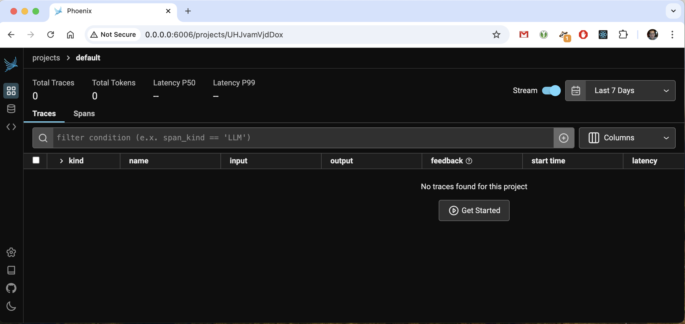

# demo-py-llm-instrumentation

Run [phoenix](https://github.com/Arize-ai/phoenix) server to observe your application:

```bash
 rye run arize-phoenix serve
```

Now you can browse to http://0.0.0.0:6006 and find the following:



