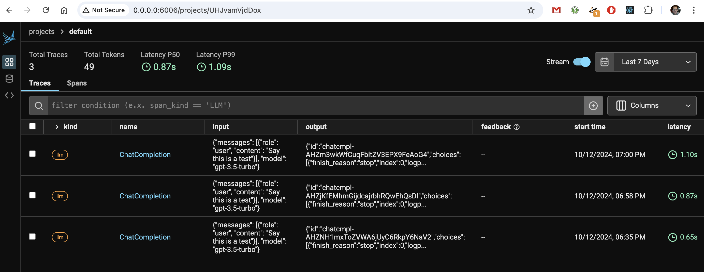
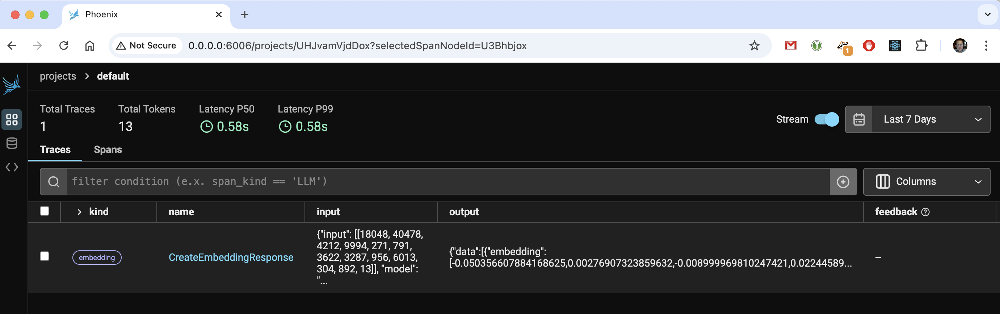

# demo-py-llm-instrumentation

Run [phoenix](https://github.com/Arize-ai/phoenix) server to observe your application:

```bash
 rye run arize-phoenix serve
```

Now you can browse to http://0.0.0.0:6006 and find the following:


Create a .env file by copying [.env.example](.env.example) and adapting the values.

Now run a sample application:

```bash
rye run python -m demo.01_openai_chat
```

Install instrumentation package(s):

```bash
rye add openinference-instrumentation-openai
```

Use [opentelemetry-instrument](https://opentelemetry.io/docs/languages/python/getting-started/#run-the-instrumented-app) to launch the sample aplication:

```bash
rye run opentelemetry-instrument \
    --service_name demo \
    --traces_exporter otlp \
    --exporter_otlp_endpoint 0.0.0.0:4317 \
    --exporter_otlp_traces_insecure true \
    python -m demo.01_openai_chat
```

And now you can observe the traces in Phoenix:



Offcourse you can also capture traces without the opentelemetry-instrumentation app.
Simply configure the OpenTelemetry SDK in your application and run it as usual.

```bash
rye run python -m demo.02_openai_chat
```

Let's populate a [LanceDB](https://github.com/lancedb/lancedb) table which we can use as [vector store](https://python.langchain.com/docs/concepts/#vector-stores)

```bash
rye run python -m demo.03_build_vector_store
```

The langchain call to create embeddings is also captured:

